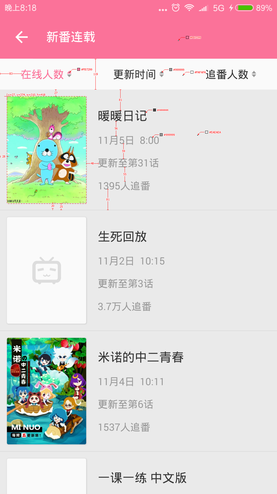

# vue-sortable-list (Vue2.0)

> 这是一个仿bilibili安卓客户端抽象出来的Vue组件


##demo

[live-demo](https://cdn.rawgit.com/bajian/vue-sortable-list/master/dist/demo.html)
##Screenshot


## Build Setup

``` bash
# install dependencies
npm install

# serve with hot reload at localhost:8080
npm run dev

# build for production with minification
npm run build
```
###How to use
```html
<sortable-list
    :titles="sorttitles"
    :list="list"
    :sorting-index='2'
    sorting-type="desc"
    @sort-finish="onSortFinsh"
    >
    <!-- list container -->
    <div :key="item.season_id" class="item" v-for="(item,index) in list">
        <div class="title">{{item.title}}</div>
    </div>
  </sortable-list>
```

```js 
    //callback after the list has been sorted ,u must update the list for Vue2.0
    methods:{
      onSortFinsh(list){
        console.log('onSortFinsh');
        this.list=list
      }
    }
```

####How to change the active title and triangle's color
```css 
//override these styles
        .sort-down-active{
          color: #fb7299;
        }
        .sort-down-active .triangle-down{
          border-top: 7px solid #fb7299 ;
        }

        .sort-up-active{
          color: #fb7299;
        }
        .sort-up-active .triangle-up{
          border-bottom: 7px solid #fb7299 ;
        }
```

## Api
### Properties
| Name                 | Type      | Default      | Description                                                        |
|----------------------|-----------|--------------|--------------------------------------------------------------------|
| titles           | `Array`  | `[]` | the obj `array` to set `title` and sort key from `list` such as [{ key:'watching_count', name:'在线人数' },{ key:'last_time', name:'更新时间' }]|
| list            | `Array`  | `[]` | the data obj array |
| sorting-index   | `Number` | `0`       | the first sorting index |
| sorting-type   | `String` | `desc`       | the first sorting type `desc`/`asc` |
| sort-finish   | `Function` | `undefined`       | callback after the list has been sorted ,u must update the list for Vue2.0, like `onSortFinsh(list){this.list=list}`|
| ==================== | ========= | ============ | =================== |





